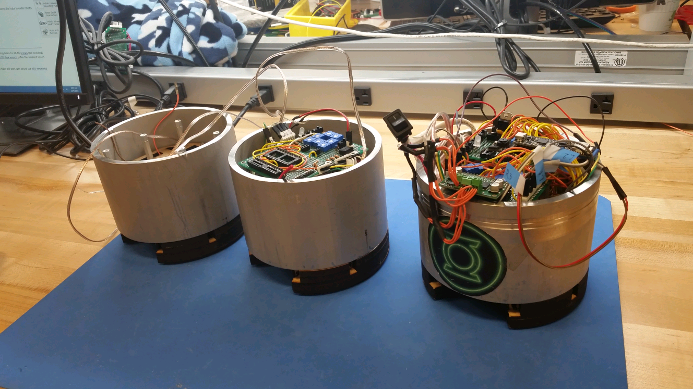
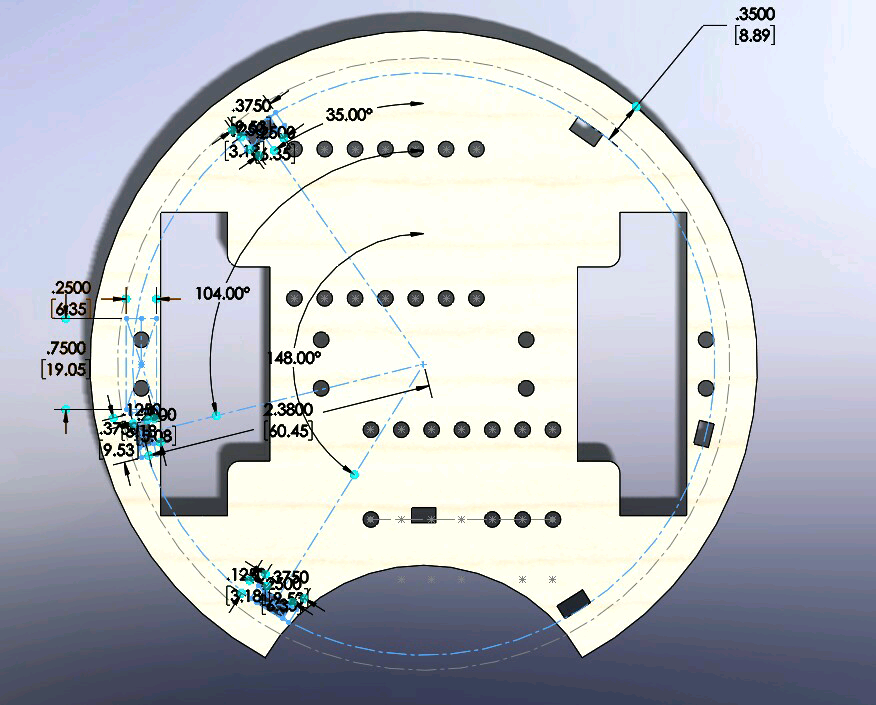
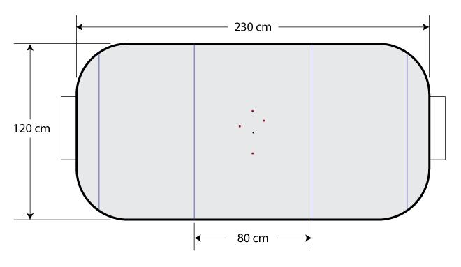
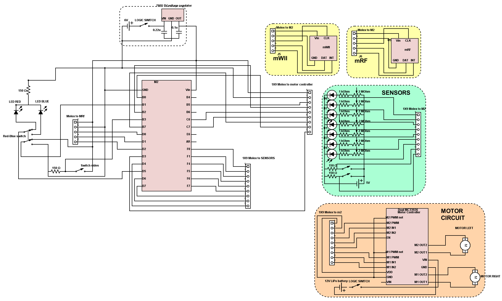
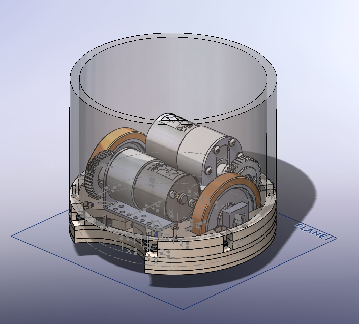
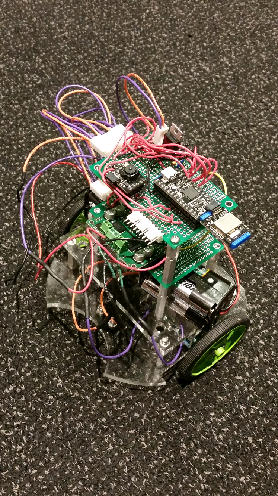

# Robockey #

Robockey is the final project in the MEAM 510 Design of Mechatronic Systems class. Over the course of one month, students work in teams of three or four to create robots that can play hockey autonomously. Students design and build the robots almost completely from scratch using basic components like motors, gears, phototransistors, resistors, microcontrollers. For this project, I was responsible for the coding as well as parts of the electrical design.

## Code and Strategy ##
The general strategy that our robot uses is to first navigate to the puck using the attached phototransistors. Then, when it detects that it has the puck using the momentary switches on the front of the robot, it carries the puck to the opponent's goal.

### Puck detection ###

The robot has 7 phototransistors located all around it. The puck has IR emitters built in to it. We use the values reported by this array of phototransistors to estimate the angle of the puck relative to the front of the robot. This code is in `puck_detection.c`

### Navigation ###

The microcontroller is connected to two motors that power the two wheels on the robot. It can set the direction of the motors as well as the speed via PWM. If the robot needs to turn to the right, the microcontroller will slow down the left wheel or even reverse it depending on how big the angle is. And vice versa for the right wheel. The code to do this can be found in `navigation.c`.

### Localization ###

The localization code tells the robot where it is as well as its orientation. This information is needed for it to navigate to the right goal when it has the puck.

There is a constellation of 4 IR lights suspended about five meters above the rink as depicted in the image above. Our robot uses a repurposed Wii robot IR camera to detect the pixel positions of these 4 lights.

We use the pixel position of the lower-most IR light in the image above as well as the pixel position of the black dot (which can be calculated from the pixel positions of the four IR lights) to estimate the robot's rotation. We unrotate the image by this value and then find the difference between the pixel position of the black dot and the image center. This tells us the displacement of the robot in the real world.

The code to do this can be found in the `localization.c` file.

## Appendix ##

### Robot in action ###

### Electrical Design ###

This is the circuit diagram for the electronics. It shows the microcontroller pins connected to a motor driver which controls the two motors. It also shows the connections to the array of sensors such as phototransistors and momentary switches that are used to find the puck as well as detect when it has the puck. Finally, it shows the Wii IR camera module which is used for localization as well as the wireless module used to receive wireless commands from the referee.

### Mechanical Design ###

The mechanical design consists of a laser-cut MDF skeleton along with a machined steel shell. The steel shell adds weight to the robot and also offers protection. Because the motors are so large that they need to be placed off-set from each other, we use 1:1 gears to transmit power to the wheels.

An early prototype:

